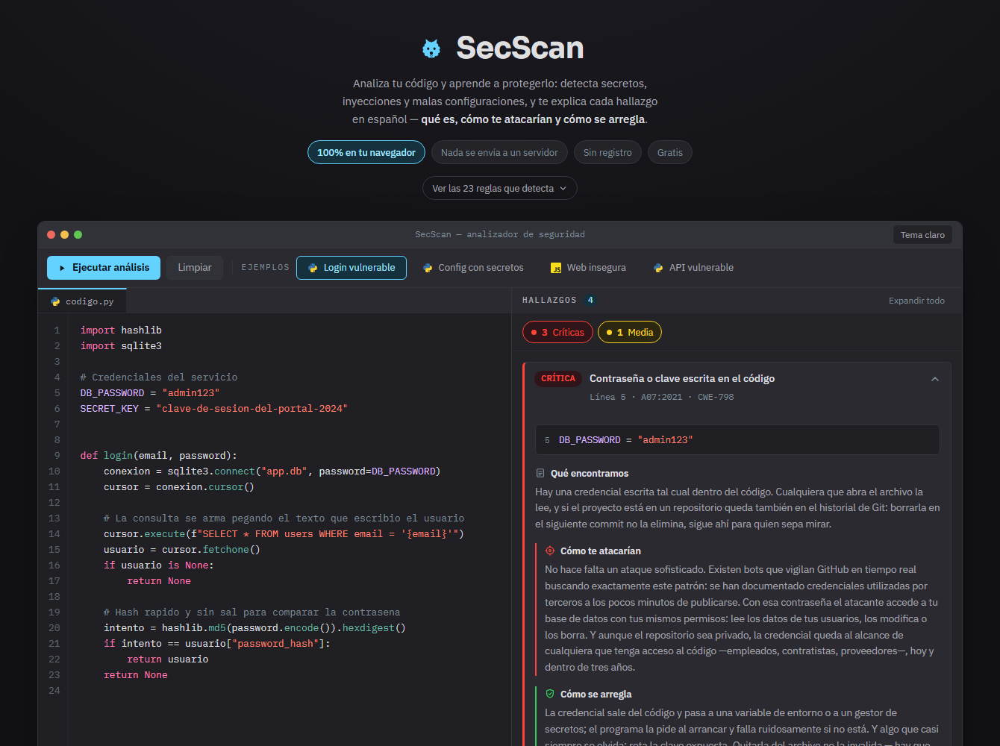
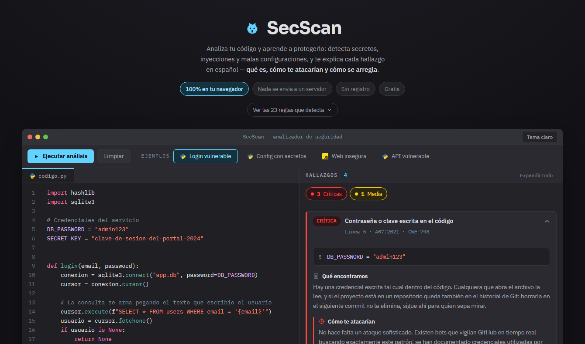

# SecScan

**Analiza tu código y aprende a protegerlo.** SecScan busca fallos de seguridad en código y
configuración, y explica cada hallazgo en español: **qué es, cómo te atacarían y cómo se arregla**.

Corre **100 % en el navegador**. No hay servidor, no hay registro, no hay coste: tu código nunca
sale de tu equipo.

**Demo:** https://sergio-osorio09.github.io/SecScan/



---

## Por qué existe

Las herramientas de análisis estático suelen decirte *qué* está mal, en inglés y para gente que ya
sabe seguridad. SecScan está pensado para el otro lado: cada hallazgo trae una ficha que enseña.
Lo puede usar un desarrollador pegando su código, y también alguien sin perfil técnico cargando un
ejemplo con un clic y entendiendo el resultado.

| Herramientas de referencia | SecScan |
| --- | --- |
| La versión gratuita es una muestra del producto de pago | Completa para su propósito, sin funciones reservadas |
| Registro técnico, para perfiles de seguridad | Educativa: cada hallazgo explica el porqué |
| Solo en inglés | En español, un nicho poco cubierto en LATAM |
| Señala el error | Describe el ataque concreto y da el código corregido |

---

## Qué detecta

**23 reglas** que reconocen alrededor de 90 patrones concretos, agrupadas por categoría del
**OWASP Top 10 (2021)** y con su **CWE** correspondiente. La aplicación las muestra todas en el
panel *"Ver las 23 reglas que detecta"*, para que quien venga a probarla sepa qué buscar.



| Regla | Severidad | OWASP | CWE |
| --- | --- | --- | --- |
| Inyección SQL por concatenación de texto | Crítica | A03 | CWE-89 |
| Contraseña o clave escrita en el código | Crítica | A07 | CWE-798 |
| Clave de acceso de AWS expuesta | Crítica | A07 | CWE-798 |
| Credencial de un servicio conocido, por su formato | Crítica | A07 | CWE-798 |
| Ruta de archivo construida con datos de fuera | Alta | A01 | CWE-22 |
| Descompresión sin validar el destino (zip slip) | Alta | A01 | CWE-22 |
| Inyección de comandos del sistema | Alta | A03 | CWE-78 |
| Uso de `eval()` / `exec()` | Alta | A03 | CWE-95 |
| XSS: HTML insertado sin sanitizar | Alta | A03 | CWE-79 |
| Plantilla del servidor construida con datos de fuera | Alta | A03 | CWE-1336 |
| XML con entidades externas (XXE) | Alta | A05 | CWE-611 |
| Token JWT leído sin verificar la firma | Alta | A07 | CWE-347 |
| Deserialización insegura | Alta | A08 | CWE-502 |
| Protección CSRF desactivada | Media | A01 | CWE-352 |
| Hash débil (MD5 / SHA-1) | Media | A02 | CWE-327 |
| Verificación de certificados TLS desactivada | Media | A02 | CWE-295 |
| Valor de seguridad generado con azar predecible | Media | A02 | CWE-338 |
| Cifrado obsoleto o en modo ECB | Media | A02 | CWE-327 |
| CORS abierto a cualquier origen | Media | A05 | CWE-942 |
| Cookie de sesión sin sus atributos de seguridad | Media | A05 | CWE-614 |
| Redirección hacia un destino que llega de fuera | Baja | A01 | CWE-601 |
| Conexión HTTP sin cifrar | Baja | A02 | CWE-319 |
| Modo depuración activado | Baja | A05 | CWE-489 |

**Lenguajes:** Python y JavaScript/TypeScript son los que están cubiertos de punta a punta. Varias
reglas alcanzan además a **Java** (inyección de comandos, XXE, secretos) y a PHP, y a archivos de
configuración genéricos —JSON, YAML, `.env`, Terraform— en todo lo que es secretos, HTTP, CORS,
cookies y depuración.

La pestaña del editor muestra el distintivo del lenguaje detectado, como en un IDE. La detección
distingue **Java de JavaScript**, que comparten llaves, punto y coma y `null`: se apoya en las
señales que solo tiene Java —la declaración de paquete, los modificadores de acceso delante de un
método, los genéricos, las anotaciones—. Gana el lenguaje con más señales siempre que reúna al
menos dos y saque ventaja al segundo; si hay empate, prefiere no inventar y se queda en genérico.
Es una etiqueta informativa: **las reglas se aplican siempre todas**, para que una detección
equivocada no esconda nunca un hallazgo.

---

## Cómo funciona

```
código  →  prepararCodigo()  →  reglas  →  hallazgos  →  interfaz
```

1. **`prepararCodigo()`** recorre el texto con un pequeño autómata que distingue comentarios,
   cadenas de comilla simple, doble, triple y plantillas. Los comentarios se borran conservando
   las posiciones, y se marca qué caracteres están dentro de una cadena. Esto es lo que evita dos
   errores clásicos: creer que las dos barras de `"http://..."` abren un comentario, y detectar un
   `eval(` que en realidad estaba escrito dentro de un texto.
2. **Las reglas** son objetos con un patrón, sus guardas negativas y su ficha educativa. Cada una
   vive en el archivo de su categoría OWASP (`src/engine/reglas/`).
3. **`analizar()`** es una función pura: mismo texto, mismo resultado. No usa red, ni disco, ni
   estado global.

### Los falsos positivos importan

Un motor que marca como fallo `password = os.getenv("DB_PASS")` —que es justo la forma correcta—
pierde la confianza del usuario en el primer intento. Por eso cada regla declara, además de su
patrón, unas **guardas negativas**,
y la batería de pruebas comprueba los dos lados: que detecta el caso vulnerable y que **no**
detecta el caso correcto.

```ts
// src/engine/reglas/secretos.ts (resumido)
export const secretoEmbebido: Regla = {
  id: 'secreto-embebido',
  severidad: 'critica',
  patron: /* password = "..." · "api_key": "..." · DB_PASSWORD=... */,
  ignorarSiLinea: [/os\.getenv|process\.env|vault|getpass|.../],  // el codigo correcto no se marca
  ignorarSiCoincide: [/(["'])\s*(?:\$\{|your_|placeholder|...)/], // ni los valores de relleno
  ficha: { queEncontramos, comoTeAtacarian, comoSeArregla, fix },
};
```

---

## Stack

| Capa | Decisión |
| --- | --- |
| Interfaz | React 19 + TypeScript, con Vite |
| Estilos | CSS con variables y CSS Modules (sin framework) |
| Paleta | Tema por defecto de Xcode para el código; colores de sistema de iOS para severidades |
| Editor | `textarea` sobre una capa de resaltado propia, sin dependencias |
| Ejemplos | Cuatro casos de un clic, con auto-análisis |
| Motor | TypeScript puro, sin librerías |
| Tipografías | Empaquetadas con la app (`@fontsource`), no se piden a un CDN |
| Backend | **Ninguno** |
| Pruebas | Vitest — 209 casos |
| CI/CD | GitHub Actions → GitHub Pages |

**Sin servidor = sin coste, sin mantenimiento y sin superficie de ataque.** La promesa de
privacidad es verificable: abre las herramientas de desarrollo, pestaña Red, y comprueba que
analizar no genera ni una sola petición.

---

## Ejecutar en local

```bash
npm install
npm run dev
```

| Comando | Para qué |
| --- | --- |
| `npm run dev` | Servidor de desarrollo |
| `npm run test` | Pruebas del motor |
| `npm run test:watch` | Pruebas en modo continuo |
| `npm run build` | Comprobación de tipos + build de producción |
| `npm run lint` | ESLint |

---

## Despliegue

El workflow de `.github/workflows/deploy.yml` ejecuta lint, pruebas y build en cada push, y publica
en GitHub Pages lo que llega a `main`.

Para activarlo: en el repositorio, **Settings → Pages → Source: GitHub Actions**. La variable
`DEPLOY_TARGET=gh-pages` hace que Vite use `/SecScan/` como ruta base; si el repositorio tiene otro
nombre, ajústalo en `vite.config.ts`.

---

## Nota de honestidad

> **Herramienta educativa.** SecScan detecta patrones de riesgo comunes mediante análisis estático.
> Ayuda a aprender y a revisar, pero **no reemplaza una auditoría de seguridad profesional**: puede
> haber falsos positivos y no lo detecta todo. En concreto, no hace análisis de flujo de datos, no
> resuelve dependencias y no ejecuta el código. Úsalo como primera línea de defensa y para entender
> el *porqué* de cada vulnerabilidad.

---

## Contribuir

Toda aportación es bienvenida: una regla nueva, una ficha educativa mejor redactada, un falso
positivo que hayas encontrado. Para una regla, el camino es corto:

1. Añade el objeto `Regla` en el archivo de su categoría OWASP (`src/engine/reglas/`).
2. Añade sus casos en la tabla `CASOS` de `src/engine/__tests__/reglas.test.ts`, por los dos
   lados: lo que debe detectar y lo que **no** debe marcar.
3. `npm run test` y `npm run lint` en verde.

Si encuentras un falso positivo, con [abrir una incidencia](https://github.com/Sergio-Osorio09/SecScan/issues)
y pegar la línea que lo provoca es suficiente: ese es justo el tipo de informe que más mejora la herramienta.

---

## Licencia

MIT — ver [LICENSE](LICENSE).

Creado por **Sergio Osorio** · Ingeniería de Software, UNMSM.
